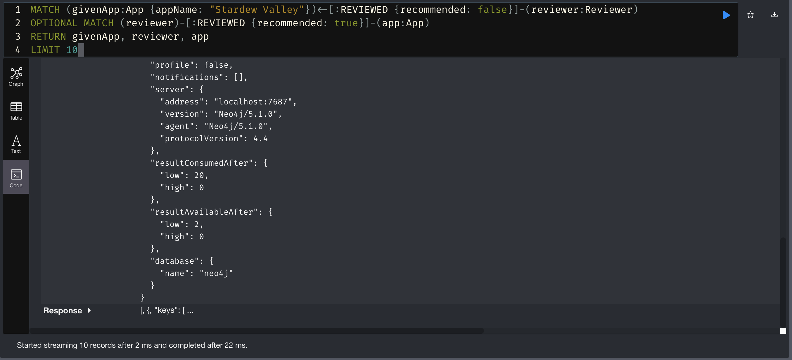
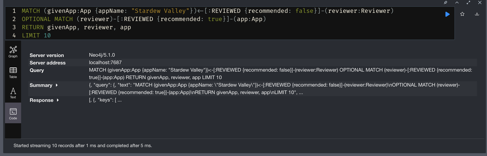

# Database Setup Guide

## Loading the Database

Ensure `steam_reviews.csv` is in the root of the project directory.

- Dataset link: https://www.kaggle.com/datasets/najzeko/steam-reviews-2021

Preprocess Steam Reviews Data:
`python preprocess_apps.py`
`python preprocess_reviewers.py`
`python preprocess_reviews.py`

Import Data into Neo4j:
`NEO4J_CONF=<absolute-path-to-neo4j-conf> neo4j-admin database import full --nodes=App="app_header.csv,steam_apps.csv" --nodes=Reviewer="reviewer_header.csv,steam_reviewers.csv" --relationships=REVIEWED="review_header.csv,steam_processed_reviews.csv" --id-type=STRING`

Run the Database:
`NEO4J_CONF=<path-to-neo4j-conf> neo4j console`

## Adding Database Index

Add Index to Database (execute at the database level):
Go to the Neo4j Browser at http://localhost:7474 and execute the following query:

```
CREATE RANGE INDEX reviewed_recommended IF NOT EXISTS
FOR ()-[r:REVIEWED]-() ON (r.recommended)
```

The query doesn't change. Using the query below, the time difference between before and after the index is added is 17 ms.
This query gets 10 negative reviews of a given app, as well as any positive reviews those reviewers have left for other games.

```
MATCH (givenApp:App {appName: "Stardew Valley"})<-[:REVIEWED {recommended: false}]-(reviewer:Reviewer)
OPTIONAL MATCH (reviewer)-[:REVIEWED {recommended: true}]-(app:App)
RETURN givenApp, reviewer, app
LIMIT 10
```

Runtime for query before adding index (completed in 22 ms):


Runtime for same query after adding index (completed in 5 ms):


## Running the Command Suite

Navigate to the root of the project directory.

Ensure all required modules are installed:
`npm i`

Ensure the database is running:
`NEO4J_CONF=<path-to-neo4j-conf> neo4j console`

Run the Command Suite:
`DB_URL=neo4j://localhost DB_PASSWORD=<db-password> ts-node command-suite.ts`